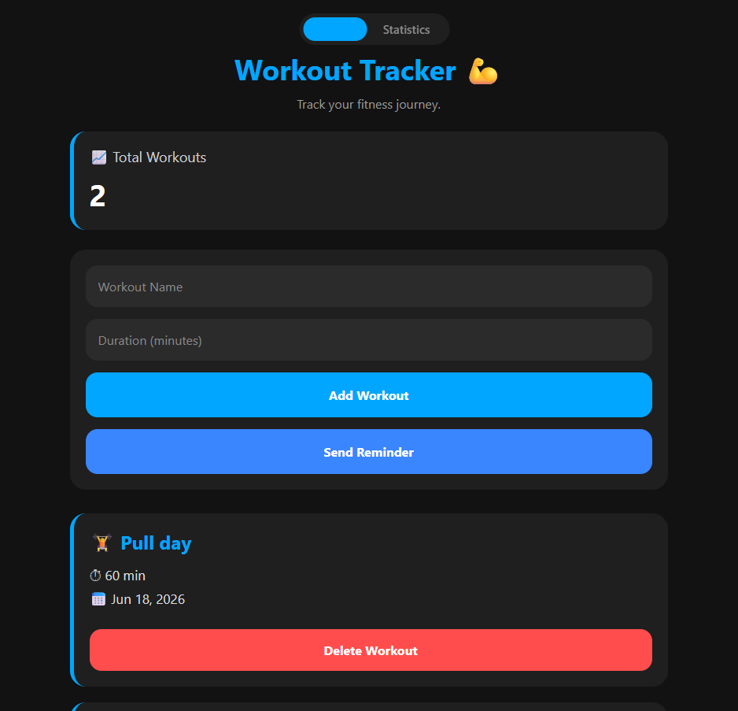
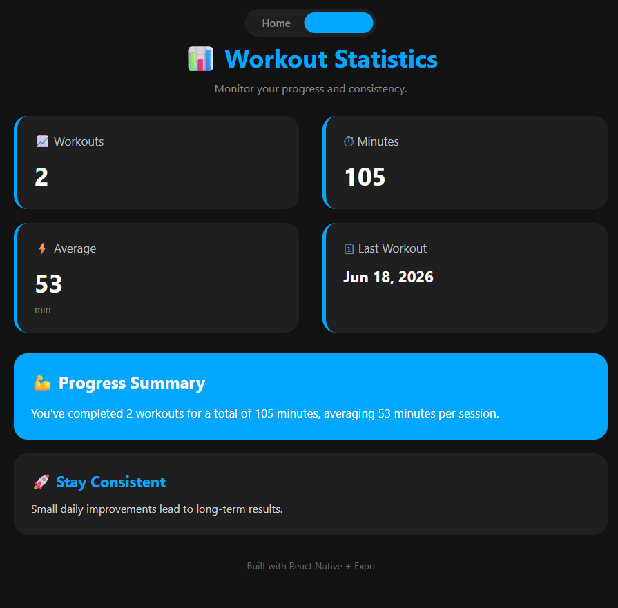

# 💪 Workout Tracker

A modern workout tracking app built with **React Native**, **Expo**, and **TypeScript**.

Track workouts, monitor progress, receive reminders, and view useful statistics through a clean dark-themed interface.

---

## 📱 Screenshots

### Home Screen



### Statistics Screen



---

## ✨ Features

- ✅ Add workouts
- ✅ Delete workouts
- ✅ Workout history
- ✅ Persistent storage with AsyncStorage
- ✅ Workout statistics
- ✅ Average workout duration
- ✅ Total minutes tracked
- ✅ Last workout tracking
- ✅ Workout reminders with notifications
- ✅ Modern dark UI
- ✅ Responsive layout
- ✅ Built with React Native + Expo + TypeScript

---

## 📊 Statistics Dashboard

Track:

- Total workouts completed
- Total workout minutes
- Average session duration
- Most recent workout
- Progress summary

---

## 🛠 Tech Stack

### Frontend

- React Native
- Expo
- TypeScript

### State Management

- React Context API

### Storage

- AsyncStorage

### Notifications

- Expo Notifications

### Navigation

- Expo Router

### Development Tools

- VS Code
- Git
- GitHub

---

## 🚀 Installation

Clone the repository:

```bash
git clone https://github.com/PatrickStrzelczyk/WorkoutTracker.git
```

Move into the project:

```bash
cd WorkoutTracker
```

Install dependencies:

```bash
npm install
```

Start the Expo development server:

```bash
npx expo start
```

---

## 📂 Project Structure

```
src/
│
├── app/
│     ├── index.tsx
│     └── explore.tsx
│
├── context/
│     └── WorkoutContext.tsx
│
├── types/
│     └── workout.ts
│
├── utils/
│     ├── workoutUtils.ts
│     └── workoutUtils.test.ts
│
├── components/
├── hooks/
└── constants/
```

---

## 🎯 Future Improvements

- Edit workouts
- Search workouts
- Workout categories
- Weekly charts
- Streak tracking
- Custom themes
- Cloud synchronization
- Export workout history

---

## 📸 Built With

- React Native
- Expo
- TypeScript
- Context API
- AsyncStorage
- Expo Notifications

---

## 👨‍💻 Author

**Patrick Strzelczyk**

GitHub:

https://github.com/PatrickStrzelczyk

---

## ⭐ Version

Current Version: **1.0**

First React Native + Expo project built from scratch.